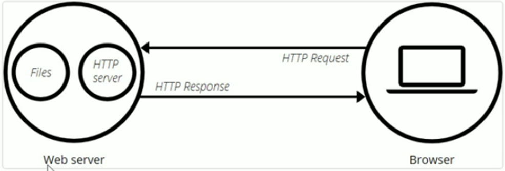

# HỌC NODEJS

### LESSON 1: CÁCH MỘT WEBSITE HOẠT ĐỘNG

**1. Mô hình Client - Server:**

> - Client: Phía người dùng
> - Một website có thể có nhiều người dùng tại một thời điểm.

> - Server: Gồm 2 thành phần:

- Tên miền (Domain): Là một tên dễ nhớ, giúp client có thể nhớ, gõ vào trình duyệt và sử dụng

- Nơi hosting files: là một máy tính trên cloud (kết nối internet), lưu trữ tất cả mã nguồn của một website

  ⟹ Hiểu đơn giản, Server là một máy tính hoạt động 24/24, giúp một website hoạt động.

**2. Vận hành một Website:**

a. Chạy LocalHost:

- Tức là chạy tại máy tính cá nhân, người khác không thể dung đường link localhost để chạy và sử dụng website được
- Ưu điểm: Bạn kiểm soát mã nguồn, thích làm gì thì làm ⇒ Đây là quá trình xây dựng website từ con số 0
- Nhược điểm: Người khác sẽ không thể sử dụng được trang web của bạn (gõ vào máy tính khác nó không hiện ra gì đâu)

b. Chạy với Hosting:

Gồm 2 bước: Mua tên miền và mua Hosting

- B1: Tên miền (domain) là một tên dễ nhớ, bằng chữ, ví dụ: facebook.com, …
- B2: Mua hosting và deploy code của bạn lên đấy.
  > Việc mua hosting sẽ cho bạn một địa chỉ IP (IP của server, ví dụ: 192.168.1.69), đồng thời cung cấp nguồn tài nguyên để bạn triển khai (deploy) code local lên lưu trữ tại đây.
  > Sau khi deploy xong, bạn cần mapping domain với cái IP hosting này.

**3. Dữ liệu để hiển thị Website:**

Dữ liệu hiển thị là cái mà “mắt” của chúng ta thấy, gồm 2 loại: dữ liệu động (dynamic) và dữ liệu tĩnh (static).

a. Dữ liệu tĩnh (static):

- Dữ liệu static là các dữ liệu cố định, và không thay đổi theo thời gian. Ví dụ: tên/ảnh, thương hiệu website
- Do tính chất “cố định”, chúng ta thường “hard – code” fix cứng trong mã nguồn (source code), viết 1 lần và dung mãi mãi.
- Ưu điểm: Dữ liệu được lưu trong source code, all in one
- Nhược điểm: Khó thay đổi khi có yêu cầu sửa đổi.

b. Dữ liệu động (Dynamic):

- Dữ liệu Dynamic là dữ liệu có thể thay đổi theo thời gian (ngược hoàn toàn với static). Ví dụ: hôm nay bạn lướt facebook, post hiện lên nó khác, ngày mai nó khác và thay đổi liên tục.
- Ưu điểm: thay đổi liên tục theo thời gian
- Nhược điểm: Cần code logic để xử lý.

c. Lưu trữ dữ liệu:

Các dạng lưu trữ dữ liệu phổ biến: Lưu trữ data trong file và lưu trữ dữ liệu trong “phần mềm”

- **Lưu trữ trong file:** Ví dụ: bạn lưu trữ thông tin user trong file .txt, file .csv
- Ưu điểm: Thuận tiện cho người không coding và quen thuộc với các phần mềm cơ bản (word, excel, …)
- Nhược điểm: Lưu trữ data không hiệu quả nếu như data gồm nhiều loại dữ liệu và kích thước lớn.
- **Lưu trữ trong “phần mềm”:** Các phần mềm hỗ trợ việc lưu trữ data, gọi là các hệ quản trị cơ sở dữ liệu, hiểu đơn giản là database.
- Ưu điểm: Lưu trữ data hiệu quả, đảm bảo lưu trữ được nhiều loại dữ liệu và khối lượng dữ liệu lớn
- Nhược điểm: cần học cú pháp để có thể sử dụng được những phần mềm này.

**4. Website khi có lưu trữ data:**

**Data được lưu trữ ở đâu?**

_Ví dụ: Người dùng thực hiện hành động đăng nhập_

- B1: Nhập Username/Password
- B2: Nhấn nút đăng nhập
- B3: Nhận kết quả

=> Phía sau nó thực chất là gì?

> Từ bước 2 chuyển sang bước 3, website sẽ cần phải kiểm tra thông tin người dùng cung cấp, và thông tin "nó đã được lưu trữ trước đấy - tập User". Nếu thông tin lưu trữ là chính xác => Thành công

_Vậy Data được lưu trữ ở đâu?_

=> Chúng ta sẽ dùng database để lưu trữ dữ liệu

**5. Database:**

Database là cách chúng ta “tổ chức và lưu trữ” dữ liệu website một cách hiệu quả.

Ví dụ: Website có 100k user, bạn cần tìm thông tin của bạn (1 rows/record) trong 100k ấy. Nếu không “tổ chức” dữ liệu, thì làm sao có thể giảm thiểu thời gian tìm kiếm?

Với database, chúng ta lưu trữ dữ liệu với 2 cách:

- Sử dụng dữ liệu quan hệ (Relational database – SQL): MySQL, Postgres, Oracle, SQL Server …
- Sử dụng dữ liệu phi quan hệ (Non Relational database – NoSQL): MongoDB, Redis …

a. SQL (Relational Database):

- Là cơ sở dữ liệu quan hệ
- Dữ liệu được lưu trữ trong các tables. Mỗi table sẽ có nhiều rows, fields
- Các tables có “quan hệ với nhau”

b. NoSQL:

- Là cơ sở dữ liệu phi quan hệ
- Dữ liệu được tổ chức dưới dạng ‘documents’ => Object

c. Lưu ý khi học Database (với beginer):

- Nên biết cách câu lệnh query trước (raw query) trước khi sử dụng các công cụ ORM/ODM
- Lý do: Bản chất của ORM/ODM là giúp code ngắn đi cho dev, tuy nhiên nó vẫn “convert” ra raw query (vì database chỉ có thể hiểu raw query, không thể hiểu các cú pháp ORM/ODM)
- Thành ra, trong trường hợp ORM/ODM bị lỗi, chúng ta cần check câu lệnh "raw query" nó tạo ra để biết được lỗi đang ở đâu

==============================================================================================================================
